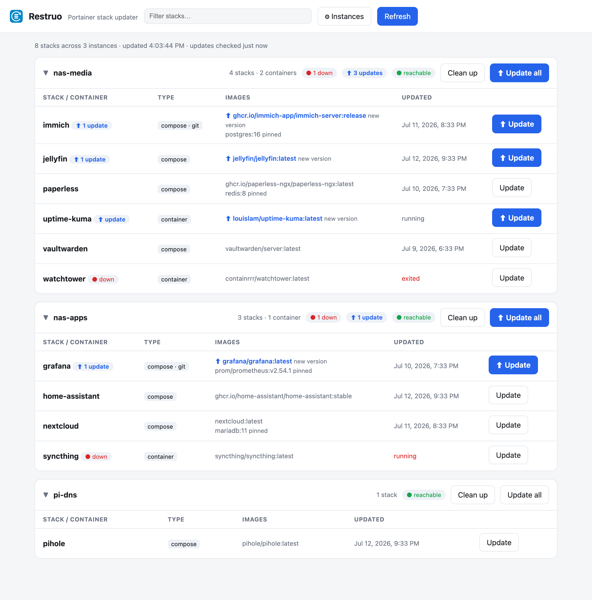

# Restruo

**One dashboard for all your Portainer instances, with a one-click repull + redeploy per
stack.** It replaces the per-stack ritual — log in → open stack → Editor → Update the
stack → tick *Re-pull image* → Deploy — and it replaces doing that on every machine
separately.

[](https://github.com/jwapps-app/restruo/actions/workflows/docker.yml)
[](LICENSE)



## What it does

- **Aggregates every Portainer you own** into one list — stacks *and* containers that
  aren't part of a stack.
- **Update button per stack**: repulls the image(s) and redeploys through the Portainer
  API, preserving env vars. Standalone containers are recreated on a fresh pull.
- **Tells you what actually needs updating.** It compares the digest of the image your
  container is *really running* against the registry, and badges only what's behind.
  Pinned tags (`postgres:16`) are deliberately left alone. **Update all** then touches
  only the flagged items.
- **Red dot for trouble** — containers that are stopped, or running but failing their
  healthcheck.
- **Cleans up after itself**: prune unused images (the ones your `:latest` updates leave
  behind), networks, and — if you explicitly ask — unused volumes.
- **Installs as a web app.** Add it to your phone's home screen; a 30-day session means a
  force-closed app reopens signed in.
- Instances are added from a settings page — no config files, no restarts.

Stateless apart from its instance list: Portainer stays the source of truth for stacks.
Built and tested against Portainer 2.x (Community Edition).

## Quick start

**Requirements:** Docker, and at least one Portainer 2.x instance you can reach.

Deploy as a Portainer stack (paste this into **Stacks → Add stack**) or with
`docker compose up -d`:

```yaml
services:
  restruo:
    image: ghcr.io/jwapps-app/restruo:latest
    container_name: restruo
    ports:
      - "8080:8080"
    volumes:
      - restruo-data:/data
    environment:
      - DASHBOARD_PASSWORD=change-me
    restart: unless-stopped

volumes:
  restruo-data:
```

Then open `http://<host>:8080`, sign in as `admin` with that password, and click
**⚙ Instances** to add your Portainers. For each one you can use:

- **Username & password** — the same login you use in the Portainer UI. Restruo exchanges
  it for a session token and re-authenticates when it expires. (Not for OAuth/SSO
  accounts.)
- **API token** — create one under **My account → Access tokens** in that Portainer.
  Preferred: it's revocable without changing your password.

Untick **Verify TLS certificate** for self-signed certs, and use **Test connection**
before saving. Instances persist in the `restruo-data` volume, so they survive updates.

### Configuration

Everything is optional except the password.

| Variable | Default | Purpose |
|----------|---------|---------|
| `DASHBOARD_PASSWORD` | — | **Required.** Dashboard login password |
| `RESTRUO_USERNAME` | `admin` | Dashboard login username |
| `RESTRUO_TITLE` | `Restruo` | Dashboard title |
| `RESTRUO_FLOATING_TAGS` | `latest` | Comma-separated tags treated as rolling for update checks — e.g. `latest,release` if you run Immich |
| `RESTRUO_REFRESH_SECONDS` | `180` | How often an open dashboard re-reads container state. `0` disables |

For the rest (update-check interval, disabling auth, pre-seeding instances) mount a YAML
file at `/config/config.yaml` — see [`config.example.yaml`](config.example.yaml).

## How updates work

**Applying an update** does exactly what the Portainer UI does:

- **Git-based stack**: `PUT /api/stacks/{id}/git/redeploy` with
  `RepullImageAndRedeploy: true`.
- **Compose/editor stack**: fetches the current stack file, then `PUT /api/stacks/{id}`
  re-sending file and env vars with `PullImage: true`.
- **Standalone container**: Portainer's recreate action with a fresh pull.

Env vars and the stack's `EndpointId` are always re-sent from the live stack object, so a
redeploy never wipes your environment. Swarm stacks use the compose path, which Portainer
performs as a rolling service update.

**Detecting an update** compares digests, downloading nothing:

- Only images on a **floating tag** are checked — `latest` by default. Add others with
  `RESTRUO_FLOATING_TAGS`; some projects ship on `:release` or `:stable`. Everything else
  reads as **pinned** and is left alone, which is the point of pinning.
- The comparison uses the digest of the image the container is *actually running*, not
  what the local tag points at — those drift apart when something re-pulls a tag without
  recreating the container.
- Works anonymously against Docker Hub, ghcr.io, lscr.io and other v2 registries. Locally
  built images and private registries show as not checkable.
- Runs every 6 hours (configurable) and whenever you hit **Refresh**, which reloads
  container state immediately and scans registries in the background.

## Updating Portainer itself

Restruo refuses to update a `portainer/portainer-*` container, and shows a disabled
button instead. Portainer dies the moment it stops its own container, so an API-driven
recreate can never finish — it just leaves Portainer stopped with the new image pulled
but unused. (If that happens to you by other means: nothing is damaged, just start the
container again.)

Upgrade it from the host instead, matching your original ports and volumes — check with
`docker inspect portainer` first:

```sh
docker pull portainer/portainer-ce:latest
docker stop portainer && docker rm portainer
docker run -d --name portainer --restart=always \
  -p 9443:9443 \
  -v /var/run/docker.sock:/var/run/docker.sock \
  -v portainer_data:/data \
  portainer/portainer-ce:latest
```

Portainer's own config lives in its data volume and survives the recreate.

## Security

Restruo holds credentials that can redeploy anything on every machine you connect to it,
so keep auth on and keep it on your LAN. See [SECURITY.md](SECURITY.md) for what's stored
where, deployment expectations, and how to report a vulnerability.

## API

Every endpoint except `/healthz`, `/api/login` and the static shell requires auth (session
cookie or HTTP basic, so `curl -u` works).

| Method | Path | Purpose |
|--------|------|---------|
| GET | `/api/instances` | Managed instances + reachability (never secrets) |
| POST | `/api/instances` | Add an instance |
| PUT | `/api/instances/{iid}` | Edit an instance (blank secret = keep existing) |
| DELETE | `/api/instances/{iid}` | Remove an instance |
| POST | `/api/instances/test` | Test a connection without saving |
| GET | `/api/stacks` | All stacks and standalone containers, with state |
| POST | `/api/instances/{iid}/stacks/{sid}/update` | Repull + redeploy one stack |
| POST | `/api/instances/{iid}/containers/{cid}/update` | Repull + recreate one container |
| POST | `/api/instances/{iid}/prune` | Remove unused images/networks/volumes |
| GET | `/api/updates` | Cached update-check results |
| POST | `/api/check-updates` | Run an update check now |
| POST | `/api/login`, `/api/logout` | Session cookie in / out |
| GET | `/healthz` | Liveness (no auth) |

## Development

```sh
python -m venv .venv && .venv/bin/pip install -r requirements-dev.txt
DASHBOARD_PASSWORD=dev .venv/bin/uvicorn app.main:app --reload --port 8080
.venv/bin/pytest
```

The backend is FastAPI (`app/`), the frontend is one dependency-free `web/index.html`,
and the tests mock Portainer and the registries with `httpx.MockTransport` — no live
instance needed.

## Alternatives

Worth knowing about, because they may fit you better:

- **[Watchtower](https://github.com/containrrr/watchtower)** — automatic scheduled
  updates. Hands-off, but no dashboard and it can fight Portainer's view of stacks.
- **[What's-Up-Docker](https://github.com/getwud/wud)** — excellent update *detection* and
  notifications, per-container rather than per-stack.
- **Portainer stack webhooks** — a redeploy URL per stack; fine for one or two, no
  aggregation.
- **Portainer Agent** — consolidates machines into one Portainer as environments. Changes
  your topology and still has no bulk one-click repull.

Restruo exists for the specific gap: several independent Portainers, one page, a manual
button per stack, and a badge that tells you which button is worth pressing.

## License

[AGPL-3.0](LICENSE) — you're free to use, modify, and self-host this software;
if you run a modified version as a network service, you must make your source
available to its users.
